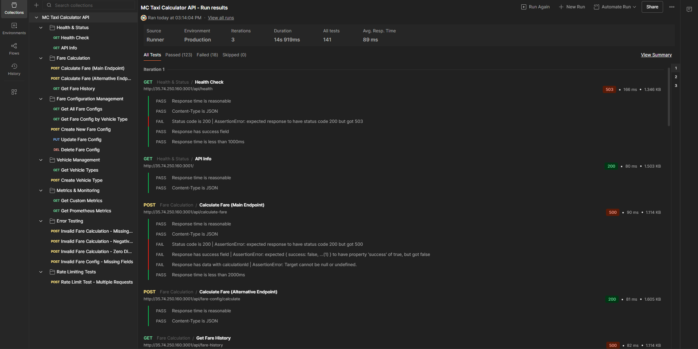
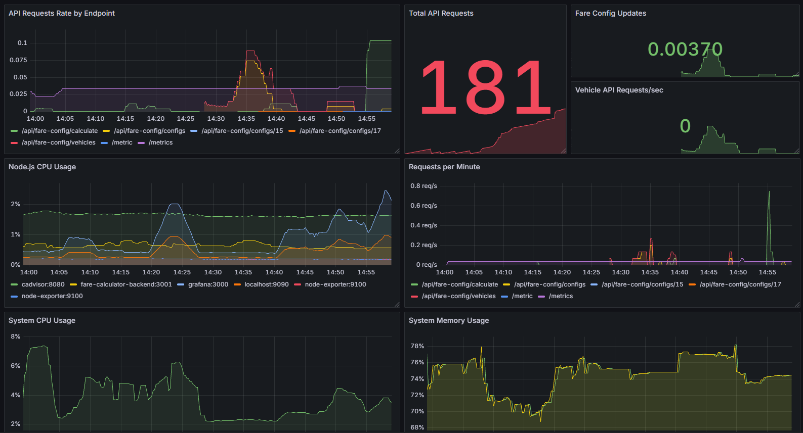
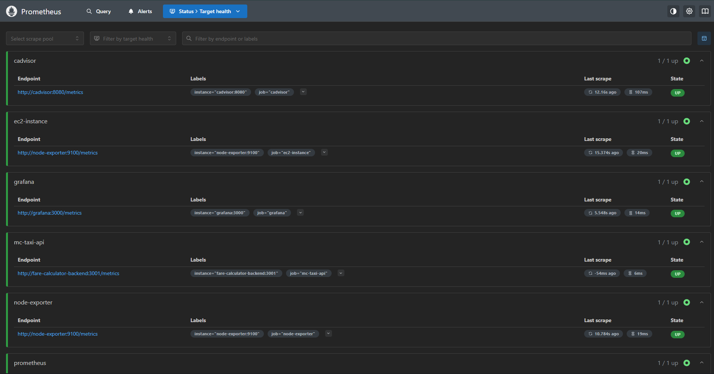
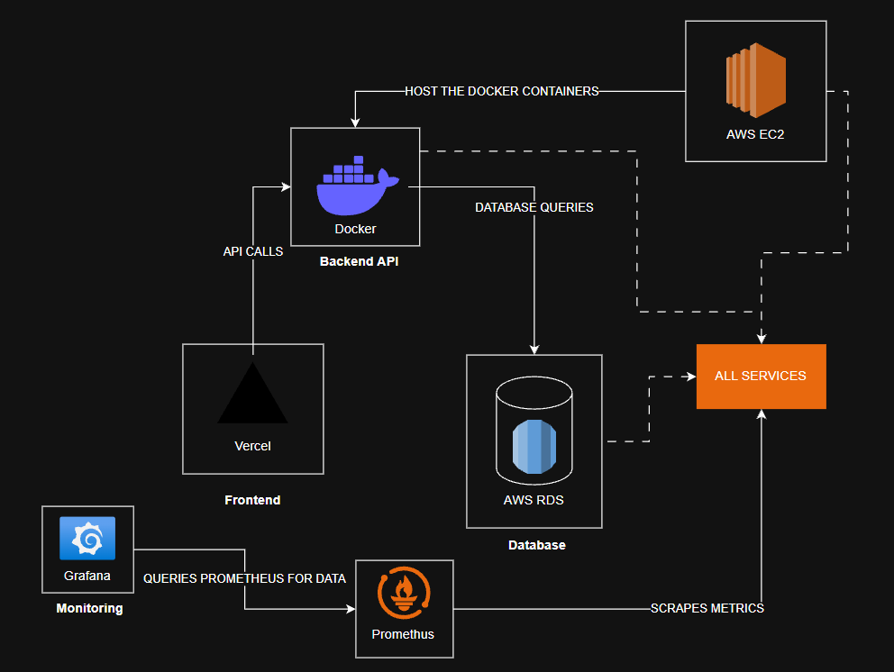
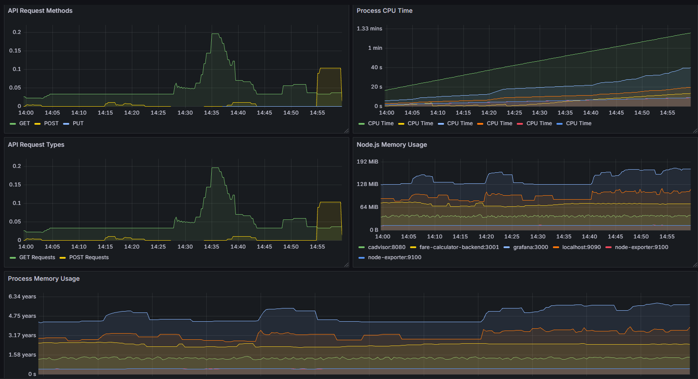

#  MC Taxi Calculator

A motor taxi fare calculator built with Next.js, Express.js, and PostgreSQL. Features real-time calculations, admin panel, and comprehensive monitoring.

##  **My Learning Journey**

This project represents my learning expirience in engineering a small prototype project for a frontend and backend API using RESTful. This is not the **Best** way to configure, engineer, or design a system as this was just a prototype for my learning path. I'm planning to use kubernetes (k8) but maybe when i have some time. I was inspired to do this small project because of my current work, I was exposed to diffirent tech used in actual production hence it drives me to learn more of this as this is really interesting as heck. I am fammiliar with websocket like websocket.io but planned not to integrate it as it will take a huge amount of time sorry.

### **Why This Project?**

I wanted to build something practical while learning the core technologies that every DevOps/Cloud Engineer should know:

- **AWS EC2**: Understanding virtual machines, instance management, and cloud computing fundamentals
- **AWS RDS**: Learning managed database services and how they differ from self-hosted solutions
- **Backend API Development**: Building RESTful APIs with Express.js to understand how services communicate
- **Docker & Docker Compose**: Containerization is crucial for DevOps - learning how to package applications and manage multi-container environments
- **Database Migration**: I started with MongoDB (NoSQL) to understand document-based databases, then migrated to PostgreSQL (SQL) on AWS RDS to experience the differences between NoSQL and relational databases


### **The Migration Story**

Originally, this project used **MongoDB** - a NoSQL database that I was familiar with. However, I decided to migrate to **PostgreSQL on AWS RDS** to learn how to implement a database with SQL as my previous projects rely on NoSQL as a detabase. You can use this project as a means to help visualize a small scale infra.

---


[](https://nextjs.org/)
[](https://www.typescriptlang.org/)
[](https://reactjs.org/)
[](https://nodejs.org/)
[](https://www.postgresql.org/)
[](https://aws.amazon.com/)
[](https://www.docker.com/)

##  Project Overview

<div align="center">
  
  
  
</div>

*Complete API testing with Postman • Real-time monitoring with Grafana • Metrics collection with Prometheus*

- **App**: http://35.74.250.160:3000
- **API**: http://35.74.250.160:3001
- **Admin**: http://35.74.250.160:3000/admin

## Tech Stack

**Frontend**: Next.js, TypeScript, React, Tailwind CSS, Framer Motion  
**Backend**: Node.js, Express.js, PostgreSQL  
**Infrastructure**: Docker, AWS EC2, AWS RDS  
**Monitoring**: Prometheus, Grafana

##  Quick Start

```bash
# Install dependencies
npm install

# Set up environment variables like API keys or database access
cp env.example .env

# Start with Docker
docker-compose -f docker-compose.simple-images.yml up
```

##  API Endpoints

- `POST /api/calculate-fare` - Calculate taxi fare
- `GET /api/health` - Health check
- `GET /metrics` - Prometheus metrics
- `GET/POST/PUT /api/fare-config/*` - Fare configuration

###  API Testing with Postman

Complete Postman collection with all endpoints and automated tests:


**Features:**
- Comprehensive test coverage for all endpoints
- Automated validation tests
- Environment support (Local & Production)
- Error scenario testing
- Rate limiting tests

## Architecture

<div align="center">
  
</div>

### System Components & Connections

**Frontend Layer:**
- **Vercel** (Frontend) → **Docker** (Backend API) via API calls
- Next.js application serving the user interface

**Backend Layer:**
- **Docker** (Backend API) → **AWS RDS** (Database) via database queries
- Node.js/Express.js API handling business logic

**Infrastructure Layer:**
- **AWS EC2** hosts the Docker containers
- **AWS RDS** provides managed PostgreSQL database

**Monitoring Layer:**
- **Prometheus** scrapes metrics from all services
- **Grafana** queries Prometheus for data visualization
- Real-time monitoring of application performance and system health

### Data Flow
```
Frontend (Next.js) → API (Express.js) → Database (PostgreSQL)
                             ↓
                    Monitoring (Prometheus + Grafana)
```

##  Features

- Real-time fare calculations
- Admin panel for fare configuration
- Comprehensive monitoring with Grafana
- Responsive design with dark/light mode
- Rate limiting and security
- Docker containerization

### Admin Panel

**Admin Features:**
- Dynamic fare configuration management
- Vehicle type creation and deletion
- Real-time fare rule updates
- Confirmation modals for safety
- Error handling and validation

##  Monitoring

Access Grafana dashboards for real-time metrics on application performance, system health, and business metrics.

###  Grafana Dashboards

Comprehensive monitoring with beautiful visualizations:




**Dashboard Features:**
- Real-time application performance metrics
- System health monitoring (CPU, Memory, Disk)
- Business metrics (fare calculations, user interactions)
- Database performance tracking
- Container resource utilization

###  Prometheus Metrics

Powerful metrics collection and alerting:


**Monitoring Capabilities:**
- HTTP request metrics (response times, status codes)
- Custom business metrics
- System resource monitoring
- Alerting and notifications
- Historical data analysis

---

⭐ **Star this repo** if you find it useful!
